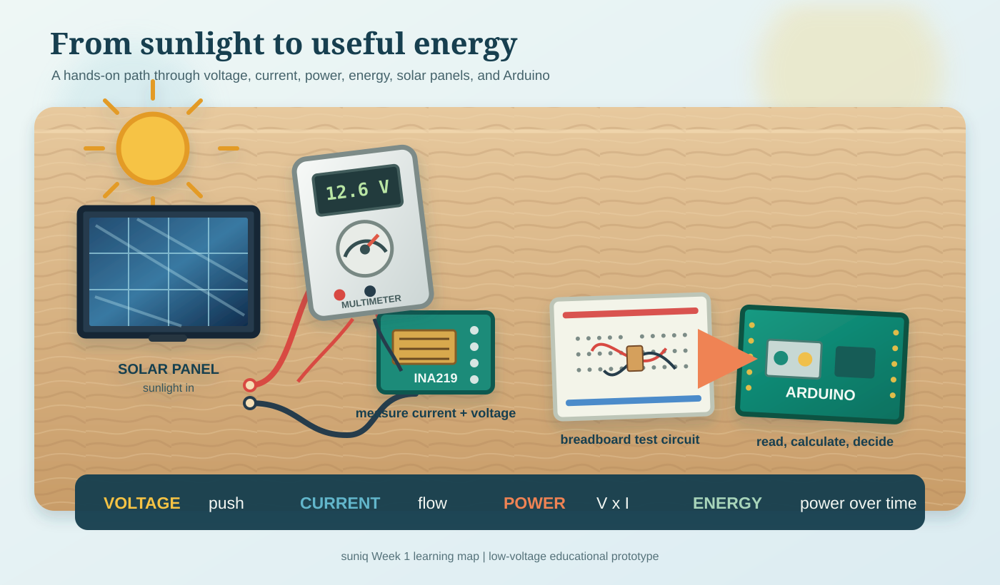

# suniq: 7-Week Build Plan

## Goal

Build a working web app and a small, safe solar prototype for the Congressional App Challenge.

**Start:** September 8, 2026  
**Submission deadline:** October 26, 2026 at 12:00 p.m. EDT  
**Project:** suniq — an adaptive solar-energy manager

## Final result

By the deadline, the project should include:

- A working web dashboard
- Real solar-panel measurements
- Charts for voltage, current, power, and battery level
- A simple energy-prediction feature
- Recommendations: run load, conserve energy, or charge battery
- An MPPT-versus-PWM comparison
- A safe, low-voltage hardware demonstration
- A public demonstration video
- A GitHub repository and project documentation

## Weekly time commitment

Plan for approximately **8–12 hours per week**:

- 3–4 hours learning
- 4–6 hours coding/building
- 1–2 hours testing and documentation

## Week 1: September 8–14 — Learn and set up

### Learning target

Understand voltage, current, power, energy, solar panels, Arduino, Python, HTML, CSS, and JavaScript.



*Learning flow: sunlight is measured, converted into power and energy data, and read by an Arduino-based prototype.*

### Web target

- Install a code editor and Python.
- Create a GitHub repository.
- Create a basic webpage with the title “suniq.”
- Write one sentence explaining the app.

### Hardware target

- Obtain the small solar panel, Arduino, INA219, breadboard, wires, and multimeter.
- Learn to measure voltage safely.
- Measure the panel’s open-circuit voltage in sunlight.

### End-of-week deliverables

- Project notebook started
- Parts list completed
- System diagram completed
- GitHub repository created
- First solar-panel measurement recorded

## Week 2: September 15–21 — Build the web dashboard

### Web target

Build a dashboard using simulated data. Display:

- Voltage
- Current
- Power
- Battery level
- A solar-power chart

Add buttons for “Sunny,” “Cloudy,” and “Shaded.”

### Hardware target

- Build a simple solar-panel-and-LED/resistor test circuit.
- Measure voltage, current, and power manually.
- Test different panel angles.

### End-of-week deliverables

- Dashboard opens on the laptop.
- Buttons change the displayed data.
- At least three manual solar tests are recorded.

## Week 3: September 22–28 — Add calculations and decisions

### Web target

Add:

```text
Power = Voltage × Current
Energy = Power × Time
```

Add simple recommendations:

```text
Low battery → Conserve energy
Strong sunlight and acceptable battery → Run load
Falling sunlight → Conserve energy
```

### Hardware target

- Connect the INA219 to the Arduino.
- Read voltage and current.
- Display readings in the Arduino Serial Monitor.
- Compare sensor readings with the multimeter.

### End-of-week deliverables

- App calculates power correctly.
- Recommendation changes when conditions change.
- Sensor readings are reasonably close to multimeter readings.

## Week 4: September 29–October 5 — Collect real data

### Web target

- Add CSV data upload or import.
- Display real measurements in charts.
- Add labels showing whether data is simulated or real.

### Hardware target

Record solar data every 5–10 seconds under:

- Direct sunlight
- Partial shade
- Different panel angles
- Morning or afternoon conditions

Record voltage, current, power, light level, and temperature if available.

### End-of-week deliverables

- At least one real CSV data file
- At least three real test sessions
- Graph of solar power over time
- Sensor readings checked against the multimeter

## Week 5: October 6–12 — Add battery and adaptive control

### Web target

Add:

- Battery-level display
- Daily energy total
- Load status
- Recommendation explanation
- “Days of backup” or “hours remaining” estimate

### Hardware target

Only with adult or mentor review:

- Add a small sealed low-voltage battery.
- Add a fuse near the battery positive terminal.
- Use a commercial low-voltage solar charge controller as a safe baseline.
- Connect a small LED, fan, or pump.

### End-of-week deliverables

- Small load can be turned on and off safely.
- App shows battery and load status.
- Adaptive rules respond to low battery and changing solar power.

If battery work is delayed, use simulated battery data and keep testing the web app. Do not rush unsafe wiring.

## Week 6: October 13–19 — Add prediction and MPPT comparison

### Web target

Add a simple prediction method:

1. Group previous readings by time of day.
2. Calculate average power for each period.
3. Predict the next few hours.
4. Compare predicted and actual power.
5. Calculate prediction error.

Add an MPPT/PWM comparison page showing energy collected and efficiency.

### Hardware target

- Test fixed-voltage or PWM-style operation.
- Test MPPT if the low-power converter and control circuit are ready.
- Use identical panel and sunlight conditions for comparisons.

Do not build a high-power custom charger. A documented low-voltage demonstration is sufficient.

### End-of-week deliverables

- Prediction chart completed
- Prediction error calculated
- MPPT-versus-PWM comparison completed or clearly simulated and labeled
- Final test results selected

## Week 7: October 20–26 — Polish and submit

### Web target

- Fix errors.
- Improve labels, colors, and charts.
- Make the app easy for a judge to understand in one minute.
- Add a README with setup instructions.
- Publish the app or prepare a clear local demo.

### Hardware target

- Complete the final safe wiring.
- Photograph the prototype.
- Run the final demonstration from beginning to end.
- Record backup videos in case the live demo fails.

### Submission target

Prepare:

- Public HTTPS video link
- App description
- Inspiration answer
- Technical-difficulties answer
- Version 2.0 improvements
- AI-use disclosure
- Learning/takeaway answer
- Public project or GitHub link
- 600×800 JPEG cover photo if possible

Submit before October 26. Do not wait until the final hour.

## Minimum viable project if time runs short

Keep these features:

- Working web dashboard
- Real or uploaded solar data
- Power and energy calculations
- Charts
- Simple prediction
- Adaptive recommendation
- Documented testing

Drop these first:

- Live cloud database
- Mobile app
- Advanced machine learning
- Large battery system
- Complex custom MPPT hardware

## Safety boundaries

- Low-voltage DC only.
- No household AC power.
- No rooftop panels.
- No large batteries.
- No unprotected lithium-ion cells.
- Fuse the battery connection.
- Check polarity and voltage before connecting.
- Get adult or mentor review before battery testing.

## Weekly notebook format

```text
Week/date:

Goal:

What I learned:

What I built:

Test conditions:

Measurements:

What worked:

What failed:

What I changed:

Evidence saved:

Next week's goal:
```

## Final project sentence

> suniq is a low-cost adaptive solar-energy web application that uses real-time measurements and simple predictions to help small off-grid systems decide when to run a load, conserve energy, or charge a battery.

## First day: September 8

1. Create the project folder and GitHub repository.
2. Install Python, a code editor, and a web browser.
3. Create `index.html` with the suniq title.
4. Write the project question in the notebook.
5. Make a shopping list and order only the initial measurement kit.
6. Learn how to measure DC voltage with the multimeter.

The first goal is not a finished app. The first goal is to make one small part work and document it.
